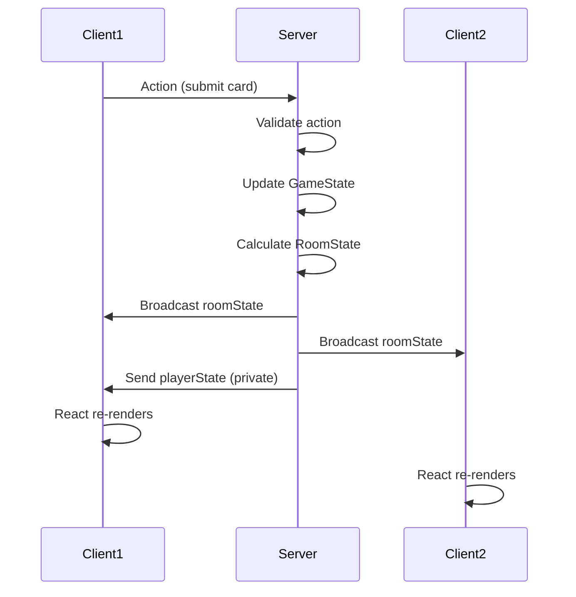
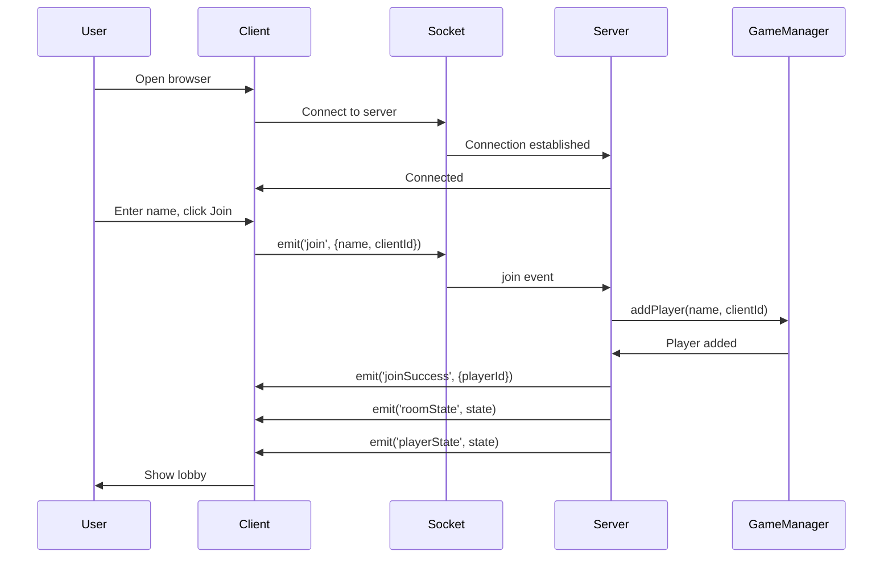
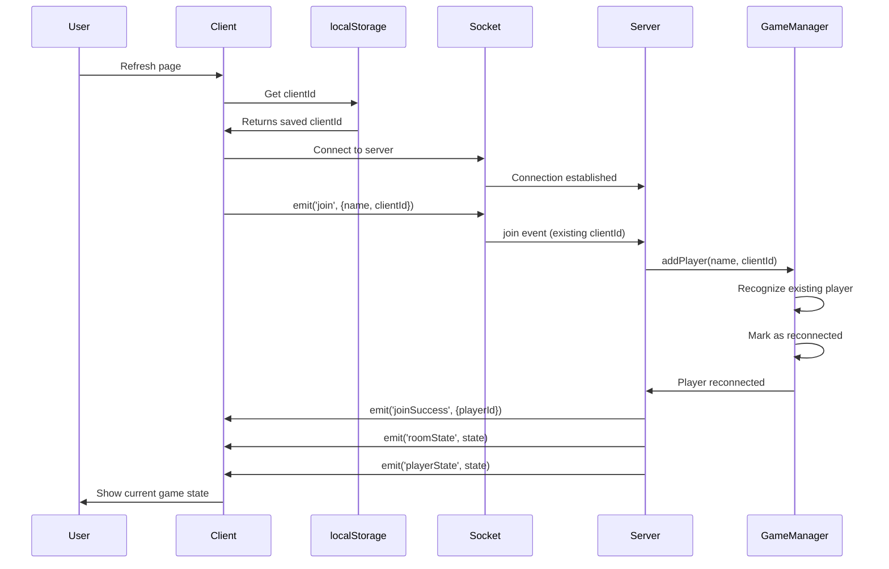
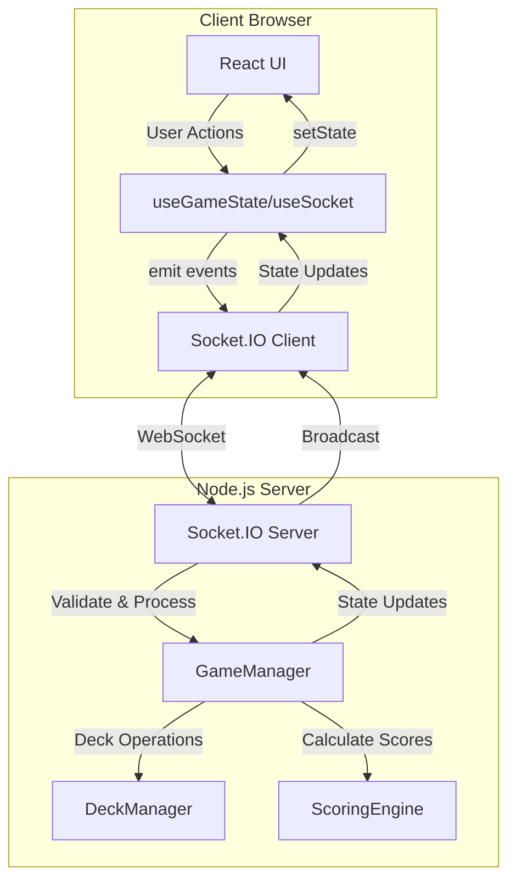

# 🎨 Dixit Game - Final Architecture

## Overview
The Dixit game now uses a **single-page unified experience** with clean, modern architecture.

---

## 📂 Page Structure

### Main Pages (Only 3!)

```
client/src/pages/
├── UnifiedGamePage.tsx  ← Main game (everything!)
├── BoardPage.tsx        ← TV/Projector display
└── DemoPage.tsx         ← Component preview
```

**That's it!** No more multiple pages or complex routing.

---

## 🎮 UnifiedGamePage - The Complete Experience

**Single page handles ALL game states:**

### State 1: JOIN (Not Logged In)
```typescript
!isJoined → Shows join screen
```
- Beautiful centered form
- Name input + Join button
- Glass-morphism card design

### State 2: LOBBY (Logged In, Before Game)
```typescript
isJoined && !isInGame → Shows lobby
```
- Two-column layout
- Players list + Admin controls
- Integrated settings (no separate page!)
- Start game button

### State 3: GAME (Playing)
```typescript
isJoined && isInGame → Shows board + modals
```
- **Board always visible** as background
- **Modal popups** for player actions
- Auto-opens/closes based on game state
- Seamless phase transitions

---

## 🔄 Game Flow

```
┌─────────────┐
│ Enter Name  │ Join Screen (centered)
└──────┬──────┘
       │
       ▼
┌─────────────┐
│ Lobby       │ Wait for players + configure
└──────┬──────┘
       │
       ▼
┌─────────────┐
│ Game Board  │ ◄─────┐
│ (Background)│       │
└──────┬──────┘       │
       │              │
       ▼              │
┌─────────────┐       │
│ Modal Popup │       │
│ (Actions)   │       │
└──────┬──────┘       │
       │              │
       └──────────────┘
    Seamless rounds!
```

**Key principle:** Never leave the page, just transition states!

---

## 📺 BoardPage - Companion Display

**Purpose:** Large-format display for TV/Projector

**Features:**
- Read-only game board view
- Winding path with player tokens
- Game status and current clue
- Revealed cards display
- Live score updates

**URL:** `/board`

**Use case:** Open on a TV while players use their phones for the main game

---

## 🎬 DemoPage - Component Preview

**Purpose:** Preview all game screens without playing

**Features:**
- Two view modes:
  - **🎮 Game View** - UnifiedGamePage with all states
  - **📺 Board Display** - BoardPage view
- Navigate through all 8 phases
- Keyboard shortcuts (←/→ for phases, V to toggle views)

**URL:** `/demo`

---

## 🗺️ Routing (Simplified!)

```typescript
Routes:
  /      → UnifiedGamePage (everything!)
  /board → BoardPage (TV display)
  /demo  → DemoPage (preview)
```

**Before refactor:** 6 routes  
**After refactor:** 3 routes  
**Reduction:** 50% fewer routes!

---

## 🎯 Component Hierarchy

```
UnifiedGamePage
├── JOIN STATE
│   └── Join Form (centered)
│
├── LOBBY STATE
│   ├── Player List
│   ├── Admin Controls
│   └── Settings (integrated!)
│
└── GAME STATE
    ├── GameBoard (background)
    │   ├── Status Bar
    │   ├── Winding Path
    │   └── Player Legend
    │
    └── Modal Popup (foreground)
        ├── Storyteller Actions
        ├── Player Actions
        ├── Voting Interface
        ├── Scoring Display
        └── Game End Screen
```

---

## 📊 Benefits of New Architecture

### Before Refactor:
- ❌ 6 separate pages
- ❌ Complex routing logic
- ❌ Page reloads between states
- ❌ Separate settings page
- ❌ Board sometimes hidden
- ❌ ~272 kB bundle size

### After Refactor:
- ✅ 1 main page (UnifiedGamePage)
- ✅ Simple state-based rendering
- ✅ Smooth transitions
- ✅ Integrated settings
- ✅ Board always visible
- ✅ ~230 kB bundle size (**40 kB saved!**)

---

## 🎨 UI/UX Principles

### 1. Single Page Flow
Everything happens on one page - no navigation confusion.

### 2. State-Based Rendering
```typescript
if (!isJoined) → Join Screen
else if (!isInGame) → Lobby
else → Game with Board + Modals
```

### 3. Board as Foundation
The game board is the central element, always visible during gameplay.

### 4. Modals for Actions
Player interactions happen in modals that:
- Auto-open when action needed
- Auto-close after submission
- Don't obscure the board
- Slide up with smooth animation

### 5. Context-Aware UI
The interface adapts based on:
- Player role (storyteller vs player)
- Game phase
- Admin status
- Action completion state

---

## 🔧 Technical Stack

### Pages:
- **UnifiedGamePage.tsx** - Main game logic
- **BoardPage.tsx** - TV display
- **DemoPage.tsx** - Preview tool

### Components (Shared):
- **GameBoard.tsx** - Visual board with path
- **HandView.tsx** - Player's cards
- **VotingView.tsx** - Card grid for voting
- **BoardView.tsx** - Large card display
- **Scoreboard.tsx** - Player scores
- **PlayerList.tsx** - Players display
- **DeckUploader.tsx** - Image upload
- **QRCode.tsx** - Join QR code

### Styling:
- **global.css** - All styles in one place
- Unified theming
- Consistent animations
- Responsive design

---

## 🚀 Development Workflow

### Local Development:
```bash
npm run dev
```

### Main Game:
```
http://localhost:3000/
```

### Board Display (on TV):
```
http://localhost:3000/board
```

### Preview Components:
```
http://localhost:3000/demo
```

---

## 📱 User Experience

### For Players:
1. **Open game on phone**
2. **Enter name** → Instantly in lobby
3. **Wait for start** → See other players join
4. **Game begins** → Board appears
5. **Modal pops up** → Take your action
6. **Repeat** → Seamless rounds

### For Viewers:
1. **Open `/board` on TV**
2. **Watch game** → See everything live
3. **Enjoy** → No interaction needed

### For Developers:
1. **Open `/demo`**
2. **Navigate phases** → See all screens
3. **Test changes** → Quick preview
4. **Deploy** → Simple architecture

---

## 🎯 Key Takeaways

### ✅ What We Kept:
- GameBoard with winding path
- Modal-based interactions
- Real-time updates via Socket.IO
- Admin controls
- TV display (BoardPage)
- Component preview (DemoPage)

### ❌ What We Removed:
- Old join page
- Old lobby page  
- Old game page
- Old admin settings page
- Multiple routes
- Page navigation logic
- ~40 kB of unused code

### 🎉 What We Gained:
- Single-page experience
- Simpler codebase
- Faster loading
- Better UX
- Easier maintenance
- Cleaner architecture

---

## 🔮 Future Enhancements

Potential additions (all within UnifiedGamePage):

1. **Animations**
   - Smoother modal transitions
   - Card flip effects
   - Token movement animations

2. **Accessibility**
   - Keyboard navigation
   - Screen reader support
   - High contrast mode

3. **Features**
   - Chat system (modal)
   - Game history (modal)
   - Player stats (modal)
   - Sound effects

4. **Optimizations**
   - Code splitting
   - Lazy loading
   - Image optimization
   - PWA support

**Note:** All additions integrate into existing architecture - no new pages needed!

---

## 🏗️ System Architecture

### Technology Stack

**Server:**
- Node.js + TypeScript
- Express (HTTP server)
- Socket.IO (WebSocket communication)
- Zod (input validation)
- Vitest (unit testing)

**Client:**
- React + TypeScript
- Vite (build tool)
- socket.io-client (WebSocket client)
- React Router (client-side routing)

### Server Architecture

```
server/src/
├── game/
│   ├── GameManager.ts      # Game orchestrator
│   ├── DeckManager.ts      # Deck operations
│   ├── ScoringEngine.ts    # Scoring logic
│   ├── Player.ts           # Player model
│   └── types.ts            # Type definitions
├── config/
│   └── index.ts            # Centralized configuration
├── utils/
│   ├── errors.ts           # Error handling
│   ├── logger.ts           # Structured logging
│   └── validation.ts       # Zod schemas
└── server.ts               # Express + Socket.IO setup
```

### Client Architecture

```
client/src/
├── pages/
│   ├── UnifiedGamePage.tsx # Main game page
│   ├── BoardPage.tsx       # TV display
│   └── DemoPage.tsx        # Preview tool
├── components/
│   ├── ui/                 # Reusable UI components
│   ├── GameBoard.tsx       # Visual board
│   ├── HandView.tsx        # Player cards
│   └── ...                 # Other components
├── hooks/
│   ├── useGameState.ts     # Game state management
│   └── useSocket.ts        # Socket connection
├── utils/
│   └── imageResize.ts      # Client-side compression
└── styles/
    └── global.css          # All styles
```

---

## 🔄 State Management Pattern

### Server is Authoritative

The server is the single source of truth for all game state. Clients only react to server updates.



### State Projection

Server maintains full `GameState` (private) and projects two views:
- **RoomState** (public): Visible to all players
- **PlayerState** (private): Each player's hand and actions

**Example:**
```typescript
// Server projects private GameState to public views
getRoomState(): RoomState {
  return {
    phase: this.state.phase,
    players: this.state.players.map(p => ({
      id: p.id,
      name: p.name,
      score: p.score,
      handSize: p.hand.length,  // Count only, not actual cards
    })),
    // Reveal cards only in appropriate phases
    revealedCards: ['REVEAL', 'VOTING', 'SCORING'].includes(phase)
      ? this.submittedCardsData
      : [],
    // ... other fields
  };
}

getPlayerState(playerId: string): PlayerState {
  return {
    playerId,
    hand: player.hand,  // Full card data (private!)
    mySubmittedCardId: this.findMySubmittedCard(playerId),
    myVote: this.findMyVote(playerId),
  };
}
```

### Client-Side State

```typescript
// Client never modifies game state
// All state comes from server via socket events

useEffect(() => {
  socket.on("roomState", (state: RoomState) => {
    setRoomState(state); // React re-renders
  });

  socket.on("playerState", (state: PlayerState) => {
    setPlayerState(state);
  });

  return () => {
    socket.off("roomState");
    socket.off("playerState");
  };
}, [socket]);
```

---

## 📡 Socket.IO Event Flow

### Client → Server Events

| Event | Payload | Action |
|-------|---------|--------|
| `join` | `{name, clientId}` | Add/reconnect player |
| `uploadImage` | `{imageData}` | Add image to deck |
| `deleteImage` | `{imageId}` | Remove image |
| `startGame` | - | Start game (admin) |
| `storytellerSubmit` | `{cardId, clue}` | Storyteller submits |
| `playerSubmitCard` | `{cardId}` | Player submits card |
| `playerVote` | `{cardId}` | Player votes |
| `advanceRound` | - | Next round |
| `adminResetGame` | - | Reset game (admin) |

### Server → Client Events

| Event | Payload | Recipients | Purpose |
|-------|---------|------------|---------|
| `joinSuccess` | `{playerId}` | Sender only | Confirm join |
| `roomState` | `RoomState` | All clients | Public game state |
| `playerState` | `PlayerState` | Specific player | Private player data |
| `error` | `GameErrorData` | Sender only | Error with severity |

### Event Validation

All incoming events validated with Zod schemas:

```typescript
socket.on("storytellerSubmit", (data) => {
  try {
    const validated = storytellerSubmitSchema.parse(data);
    gameManager.storytellerSubmitCard(clientId, validated.cardId, validated.clue);
    broadcastRoomState();
  } catch (error) {
    socket.emit("error", { severity: "error", message: error.message });
  }
});
```

---

## 🔐 Security Model

### Authentication
- No passwords or accounts
- ClientID in localStorage = identity
- First player = admin (implicit trust)

### Authorization
- Admin actions validated on server
- Check `player.isAdmin` before admin operations
- Socket events validate sender identity

### Input Validation
- All socket payloads validated with Zod
- Server enforces game rules (can't vote for own card, etc.)
- Client UI also prevents invalid actions (better UX)

### Data Privacy
- Hands are private (server enforces)
- Votes hidden until scoring phase
- No persistence (privacy by design)

---

## ⚡ Performance Considerations

### Memory Usage
- Server: ~50-100MB for 100 images
- Client: ~50MB for cached images
- Practical limit: ~8-10 players

### Network
- Initial upload: Bulk image data
- Gameplay: Small JSON payloads (<10KB)
- WebSocket: Low latency, real-time

### Optimization Strategies
- Client-side image compression (~500KB target)
- Iterative quality reduction (JPEG)
- Processing time: ~100-500ms per image
- Base64 encoding for image transport

---

## 🛡️ Error Handling

### Structured Errors

```typescript
interface GameErrorData {
  severity: "info" | "warning" | "error" | "fatal";
  message: string;
  code?: string;
  retryAction?: { label: string; action: () => void };
}
```

### Server Error Handling

```typescript
try {
  gameManager.playerVote(playerId, cardId);
  broadcastRoomState();
} catch (error) {
  if (error instanceof ValidationError) {
    socket.emit("error", {
      severity: "warning",
      message: error.message,
      code: error.code
    });
  } else if (error instanceof GameError) {
    socket.emit("error", {
      severity: "error",
      message: error.message,
      code: error.code
    });
  }
}
```

### Client Error Handling

```typescript
socket.on("error", (data: GameErrorData) => {
  setError(data);
  
  // Auto-dismiss INFO/WARNING after 5s
  if (data.severity === "info" || data.severity === "warning") {
    setTimeout(() => setError(null), 5000);
  }
  // ERROR/FATAL require manual dismiss
});
```

---

## 🔄 Component Lifecycle

### Connection Flow



### Reconnection Flow



---

## 📊 Data Flow Diagram



---

## 🎯 Best Practices

For detailed coding standards and best practices, see:
- [.cursorrules](.cursorrules) - AI assistant guidelines
- [DEVELOPMENT.md](DEVELOPMENT.md) - Development workflow
- [CONTRIBUTING.md](CONTRIBUTING.md) - Contribution guidelines

### Key Principles

**State Management:**
- Server is authoritative - never modify game state on client
- Use React hooks for socket state management
- Clean up socket listeners on unmount

**Error Handling:**
- Use structured errors with severity levels
- Auto-dismiss INFO/WARNING, manual dismiss ERROR/FATAL
- Always wrap socket handlers in try-catch

**Configuration:**
- All limits in `server/src/config/index.ts`
- Support environment variable overrides
- Never hardcode limits in multiple places

**Testing:**
- Run tests before committing: `npm test`
- Integration tests for full game flows
- Build must pass: `npm run build`

---

## 📝 Summary

**The Dixit game is now a modern, single-page application with:**
- ✅ Clean architecture
- ✅ Minimal routing
- ✅ Smooth transitions
- ✅ Always-visible board
- ✅ Modal-based interactions
- ✅ Server-authoritative state
- ✅ Structured error handling
- ✅ Type-safe communication
- ✅ Smaller bundle size
- ✅ Better UX

**Everything on one page, beautifully orchestrated!** 🎨✨


