# Dixit Game - Complete Specification Contract

**Version:** 1.1  
**Last Updated:** December 16, 2025  
**Status:** Updated - Awaiting Approval

**Changelog v1.1:**

- ✅ Win condition changed to 30 points (configurable)
- ✅ Added win target selector (30/50/Unlimited)
- ✅ Reset Game and New Deck now admin-only
- ✅ Added best practice guidelines for admin UI

---

## Table of Contents

1. [Overview](#1-overview)
2. [Game Rules & Mechanics](#2-game-rules--mechanics)
3. [Page Specifications](#3-page-specifications)
4. [Component Specifications](#4-component-specifications)
5. [User Flows & Journeys](#5-user-flows--journeys)
6. [Architecture & Data Flow](#6-architecture--data-flow)
7. [Technical Requirements](#7-technical-requirements)
8. [Appendices](#8-appendices)

---

## 1. Overview

### 1.1 Purpose

This specification document serves as the definitive contract for the Dixit local-multiplayer card game implementation. It captures the complete current state and intended behavior of the system before any refactoring begins.

### 1.2 Game Description

Dixit is a storytelling card game where players:

- Take turns being the "storyteller"
- Give creative clues about cards
- Try to guess which card matches the storyteller's clue
- Score points based on successful (but not too obvious) storytelling

### 1.3 Implementation Philosophy

- **Local Network Only**: No internet/cloud required, runs on home LAN
- **In-Memory State**: All data stored in RAM, cleared on server restart
- **Single Session**: One game room per server instance
- **Authoritative Server**: All game logic validated on server
- **Privacy First**: No accounts, tracking, or data persistence
- **Real-time Sync**: Socket.IO for instant state updates

### 1.4 Technology Stack

**Server:**

- Node.js + TypeScript
- Express (HTTP server)
- Socket.IO (WebSocket communication)
- Zod (input validation)
- Vitest (unit testing)

**Client:**

- React + TypeScript
- Vite (build tool, dev server)
- React Router (client-side routing)
- socket.io-client (WebSocket client)
- qrcode (QR code generation)

**Development:**

- npm workspaces (monorepo)
- Concurrent dev servers (hot reload)

---

## 2. Game Rules & Mechanics

### 2.1 Player Requirements

- **Minimum Players**: 3
- **Maximum Players**: Unlimited (practical limit ~8 for gameplay balance)
- **Roles**:
  - **Admin** (first player to join) - has special controls
  - **Storyteller** (rotates each round) - gives clues
  - **Players** (all others) - submit cards and vote

### 2.2 Deck Requirements

- **Minimum Images**: 100 images required to start game
- **Upload Limits**:
  - Max 20 images per player
  - Max 10MB per image before compression
  - Images auto-resized to 1024px max dimension
  - Images compressed to ~500KB target size
- **Deck Modes**:
  - `MIXED` (default): Both admin and players can upload
  - `HOST_ONLY`: Only admin can upload images
  - `PLAYERS_ONLY`: Only non-admin players can upload

### 2.3 Game Phases

The game follows a strict state machine with these phases:

```
WAITING_FOR_PLAYERS → DECK_BUILDING → STORYTELLER_CHOICE →
PLAYERS_CHOICE → REVEAL → VOTING → SCORING →
[Next Round: STORYTELLER_CHOICE] or [GAME_END]
```

#### Phase Details

| Phase                 | Description                         | Who Acts         | Duration           | Next Phase Trigger         |
| --------------------- | ----------------------------------- | ---------------- | ------------------ | -------------------------- |
| `WAITING_FOR_PLAYERS` | Waiting for minimum 3 players       | System           | Until 3+ join      | Auto: 3+ players join      |
| `DECK_BUILDING`       | Players upload images to deck       | All players      | Until admin starts | Admin: clicks "Start Game" |
| `STORYTELLER_CHOICE`  | Storyteller chooses card + clue     | Storyteller only | Until submit       | Storyteller submits        |
| `PLAYERS_CHOICE`      | Players choose matching cards       | Non-storytellers | Until all submit   | All players submit         |
| `REVEAL`              | Cards shuffled and displayed        | System           | 3 seconds          | Auto: timer                |
| `VOTING`              | Players vote for storyteller's card | Non-storytellers | Until all vote     | All players vote           |
| `SCORING`             | Display results and score changes   | All see results  | Until advance      | Any player: "Next Round"   |
| `GAME_END`            | Final scores, declare winner        | Game over        | Until reset        | Admin: "Back to Lobby"     |

### 2.4 Gameplay Flow

#### Round Start

1. Each player has 6 cards in hand
2. Storyteller is designated (rotates clockwise each round)
3. Phase: `STORYTELLER_CHOICE`

#### Storyteller Turn

1. Storyteller selects one card from hand
2. Storyteller provides a text clue (1-200 characters)
3. Card removed from hand, clue set
4. Phase: `PLAYERS_CHOICE`

#### Player Submissions

1. Each non-storyteller sees the clue
2. Each chooses one card from their hand that matches clue
3. Card removed from hand
4. When all submitted → Phase: `REVEAL`

#### Reveal Phase

1. All submitted cards (including storyteller's) are shuffled
2. Each card assigned a random position (0, 1, 2, ...)
3. Cards displayed in numbered grid
4. Auto-transition after 3 seconds → Phase: `VOTING`

#### Voting Phase

1. Each non-storyteller votes for which card they think is storyteller's
2. **Cannot vote for own card** (disabled in UI)
3. Storyteller does not vote (sees cards but can't interact)
4. When all voted → Phase: `SCORING`

#### Scoring Phase

1. Calculate scores using Dixit scoring rules
2. Display which card was storyteller's
3. Show all votes (who voted for what)
4. Display score deltas for each player
5. Update total scores
6. Player clicks "Next Round" → `STORYTELLER_CHOICE` or `GAME_END`

#### Round End

1. Players draw back to 6 cards (if deck has enough)
2. Storyteller role rotates to next player (clockwise)
3. If deck doesn't have enough cards → `GAME_END`

### 2.5 Scoring Rules

#### Scoring Logic

**Case 1: All Players Guessed Correctly**

- **Storyteller**: 0 points (clue was too obvious)
- **All Others**: +2 points each

**Case 2: No Players Guessed Correctly**

- **Storyteller**: 0 points (clue was too obscure)
- **All Others**: +2 points each

**Case 3: Some Players Guessed Correctly** (normal case)

- **Storyteller**: +3 points
- **Each Correct Guesser**: +3 points

**Bonus Points (always applied):**

- **Each Non-Storyteller**: +1 point per vote their card received (excluding storyteller's card votes)

#### Scoring Examples

**Example 1: Perfect Clue**

- Players: Alice (storyteller), Bob, Carol, Dave
- Bob and Carol guess correctly, Dave guesses wrong
- Dave's card gets 1 vote (from Bob)

Scores:

- Alice: +3 (some guessed correctly)
- Bob: +3 (guessed correctly) + 0 (no votes for his card) = +3
- Carol: +3 (guessed correctly) + 0 (no votes for her card) = +3
- Dave: 0 (guessed wrong) + 1 (Bob voted for his card) = +1

**Example 2: Too Obvious**

- All 3 non-storytellers vote for storyteller's card

Scores:

- Storyteller: 0 (too obvious)
- All others: +2 each (plus any bonus votes for their cards)

**Example 3: Too Obscure**

- No one votes for storyteller's card (all vote for other cards)

Scores:

- Storyteller: 0 (too obscure)
- All others: +2 each (plus any bonus votes for their cards)

### 2.6 Game End Conditions

**Primary End Condition:**

- Any player reaches the **win target score** (default: 30 points)

**Secondary End Condition:**

- Deck runs out of cards (cannot deal back to 6 cards per player)

**End State:**

- Phase: `GAME_END`
- Winner: Player with highest score (or player who reached target first if tied)
- Display: Final scoreboard sorted by score

**Win Target Configuration:**

- Admin can set win target in lobby: 30 / 50 / Unlimited
- Default: 30 points
- "Unlimited" mode: only ends when deck runs out

**Post-Game Options (Admin Only):**

- "Reset Game": Keep deck, reset scores to 0, start new game
- "New Deck": Clear everything, return to `DECK_BUILDING`
- "Back to Lobby": Navigate to lobby page

### 2.7 Hand Management

- **Hand Size**: Always 6 cards (when possible)
- **Initial Deal**: When game starts, each player draws 6 cards
- **Card Usage**: When player submits card, it's removed from hand
- **Refill**: After scoring, players draw back to 6 cards
- **Hand Privacy**: Players only see their own cards (server validates)

### 2.8 Admin Privileges

The first player to join automatically becomes admin (indicated by 👑 crown).

**Admin-Only Actions:**

- Set deck mode (MIXED/HOST_ONLY/PLAYERS_ONLY)
- Set win target (30/50/Unlimited)
- Lock deck (prevent further uploads/deletes)
- Start game (when 100+ images and 3+ players)
- Reset game (keep deck, reset scores)
- Create new deck (clear all, start over)

**Admin Cannot:**

- Remove other players
- Skip phases
- Modify scores manually
- See other players' hands

**UI Best Practices:**

- Admin controls appear contextually (where they're needed)
- Admin plays the game normally like other players
- Admin-only buttons clearly marked or only visible to admin
- No separate admin page (keeps UX simple for casual play)

---

## 3. Page Specifications

The application has **4 main pages** with distinct purposes and routing.

### 3.1 JoinPage (`/`)

**Route**: `/`  
**Purpose**: Entry point where new players enter their name to join the game.

#### 3.1.1 Layout

```
┌─────────────────────────────────┐
│         🎨 DIXIT                │
│  Local Multiplayer Card Game    │
│                                 │
│  [Connecting to server...]      │ (if not connected)
│                                 │
│  ┌─────────────────────────┐   │
│  │ Enter your name         │   │
│  └─────────────────────────┘   │
│                                 │
│  [      Join Game       ]       │
│                                 │
└─────────────────────────────────┘
```

#### 3.1.2 State Requirements

**Props:**

- `socket: Socket | null` - WebSocket connection
- `clientId: string` - Persistent player ID from localStorage
- `onJoin: (name: string, clientId: string) => void` - Join callback

**Local State:**

- `name: string` - User's entered name
- `joining: boolean` - Loading state during join
- `socketReady: boolean` - Whether WebSocket is connected

#### 3.1.3 User Interactions

1. **Page Load**:

   - Check if socket is connected
   - Display "Connecting to server..." if not ready
   - Auto-focus on name input when ready

2. **Name Input**:

   - Text input, max 50 characters
   - Disabled while joining or socket not ready
   - Validates: must have at least 1 character

3. **Submit Join**:

   - Button disabled if: no name, joining, or socket not ready
   - On click: emit 'join' event with `{name, clientId}`
   - Set joining=true, show "Joining..." on button

4. **Join Success**:

   - Server responds with 'joinSuccess' event
   - Navigate to `/lobby`

5. **Error Handling**:
   - Server sends 'error' event → alert error message
   - Reset joining state

#### 3.1.4 Socket Events

**Listens to:**

- `connect` - Socket connected → setSocketReady(true)
- `joinSuccess` - Join accepted → navigate to lobby
- `error` - Join failed → show alert, reset joining state

**Emits:**

- `join` - When user submits name
  ```typescript
  { name: string, clientId: string }
  ```

#### 3.1.5 Navigation

- **Entry**: Direct access to `/`
- **Exit**: Auto-navigate to `/lobby` on successful join
- **No Back**: This is the entry point

#### 3.1.6 Edge Cases

1. **Socket Not Connected**: Disable submit, show "Connecting..."
2. **Empty Name**: Disable submit button
3. **Name Too Long**: Input maxLength=50 enforces limit
4. **Join Error**: Alert message, allow retry
5. **Refresh During Join**: Reconnects with same clientId from localStorage

---

### 3.2 LobbyPage (`/lobby`)

**Route**: `/lobby`  
**Purpose**: Pre-game waiting room for deck building and player gathering.

#### 3.2.1 Layout (Three Columns)

```
┌─────────────────────────────────────────────────────────────┐
│                      Game Lobby                             │
│              Phase: DECK_BUILDING                           │
├──────────────┬────────────────────────┬─────────────────────┤
│              │                        │                     │
│  PLAYERS     │    DECK UPLOADER       │   JOIN INFO         │
│              │                        │                     │
│  • Alice 👑  │  Deck: 45 images       │  Players Join Here: │
│  • Bob       │  My images: 15/20      │                     │
│  • Carol     │                        │  ┌───────────────┐  │
│              │  Deck Mode:            │  │   QR CODE     │  │
│  [Admin]     │  [v] Mixed             │  │               │  │
│  ┌────────┐  │                        │  └───────────────┘  │
│  │ Start  │  │  [Upload Images]       │                     │
│  │ Game   │  │  [Lock Deck]           │  http://192...     │
│  └────────┘  │                        │                     │
│  Need 55     │  My Uploaded:          │                     │
│  more images │  • img_001 [×]         │                     │
│              │  • img_002 [×]         │                     │
│              │  ...                   │                     │
└──────────────┴────────────────────────┴─────────────────────┘
```

#### 3.2.2 State Requirements

**Props:**

- `roomState: RoomState | null` - Full game room state
- `playerId: string` - Current player's ID
- `onUploadImage: (imageData: string) => void`
- `onDeleteImage: (imageId: string) => void`
- `onSetDeckMode: (mode: string) => void`
- `onLockDeck: () => void`
- `onStartGame: () => void`

**Derived State:**

- `isAdmin`: Whether current player is admin
- `canStart`: `deckSize >= 100 && players.length >= 3`
- `joinUrl`: Server LAN URL or current location origin

#### 3.2.3 Left Column: Players & Admin Controls

**PlayerList Component:**

- Shows all players with their names
- Admin marked with 👑 crown
- Shows "(disconnected)" for offline players
- Displays current score (during game)

**Admin Controls** (visible only if `isAdmin`):

- **Start Game Button**:
  - Enabled if: `canStart === true`
  - Disabled shows: "Need X more images" (100 - deckSize)
  - Warning if: `players.length < 3` → "Need at least 3 players"
  - On click: calls `onStartGame()`

#### 3.2.4 Center Column: Deck Uploader

**Deck Info Display:**

- Total deck size: "Deck: 45 images"
- My contribution: "My images: 15/20"
- Lock status: "🔒 Deck Locked" (if locked)

**Game Settings** (admin only, not locked):

- **Deck Mode Selector:**

  - Dropdown with options:
    - "Mixed (Host + Players)" → MIXED
    - "Host Only" → HOST_ONLY
    - "Players Only" → PLAYERS_ONLY
  - On change: calls `onSetDeckMode(mode)`

- **Win Target Selector:**
  - Dropdown with options:
    - "30 Points" (default)
    - "50 Points"
    - "Unlimited (deck runs out)"
  - On change: calls `onSetWinTarget(target)`

**Upload Section** (if not locked):

- Hidden file input (accept="image/\*", multiple)
- "Upload Images" button:
  - Disabled if: uploading or myImages.length >= 20
  - Shows progress: "Processing 2/5..." during upload
  - On click: opens file picker
- "Lock Deck" button (admin only):
  - On click: calls `onLockDeck()`

**My Images List**:

- Shows uploaded images by current player
- Each item: image ID (first 8 chars) + delete button [×]
- Delete button hidden if deck locked
- On delete: calls `onDeleteImage(imageId)`

**Image Upload Process:**

1. User selects file(s)
2. Validate: must be image, max 10MB
3. Process each file:
   - Resize to max 1024px dimension
   - Compress to ~500KB target (JPEG quality adjustment)
4. Call `onUpload(base64Data)` for each
5. Clear file input

#### 3.2.5 Right Column: Join Information

**QR Code Display:**

- QR code component rendering `joinUrl`
- Size: 180x180px
- 2px margin

**Join URL:**

- Display text: server LAN URL (e.g., "http://192.168.1.100:3000")
- Players scan QR or type URL to join

#### 3.2.6 Navigation

**Auto-Navigation:**

- When `roomState.phase === 'STORYTELLER_CHOICE'` → navigate to `/game`
- Triggered by admin clicking "Start Game"

**Manual Navigation:**

- None (must wait for game to start)

#### 3.2.7 Socket Events

**Emits:**

- `uploadImage` - `{ imageData: string }`
- `deleteImage` - `{ imageId: string }`
- `adminSetDeckMode` - `{ mode: string }` (admin only)
- `adminSetWinTarget` - `{ target: number | null }` (admin only)
- `lockDeck` - no payload (admin only)
- `startGame` - no payload (admin only)

**Receives:**

- `roomState` - Updates all UI reactively
- `error` - Shows error message (handled by App.tsx)

#### 3.2.8 Edge Cases

1. **Upload Limit Reached**: Disable upload button, show "15/20"
2. **Deck Locked**: Hide upload/delete buttons, show lock icon
3. **Not Enough Images**: Start button disabled, show count needed
4. **Not Enough Players**: Start button disabled, show warning
5. **Admin Leaves**: First remaining player becomes new admin
6. **Deck Mode Restrictions**:
   - HOST_ONLY: Non-admin can't upload → server rejects
   - PLAYERS_ONLY: Admin can't upload → server rejects
7. **Invalid Image File**: Alert error, skip file
8. **Large Image**: Compress iteratively until <500KB or quality <0.1

---

### 3.3 GamePage (`/game`)

**Route**: `/game`  
**Purpose**: Main gameplay interface for all game phases.

#### 3.3.1 Layout (Dynamic by Phase)

**Header** (always visible):

```
┌─────────────────────────────────────────────────────┐
│  Round 3          VOTING          Alice: 15 points  │
└─────────────────────────────────────────────────────┘
```

**Content** (changes per phase - see below)

#### 3.3.2 State Requirements

**Props:**

- `roomState: RoomState | null` - Public game state
- `playerState: PlayerState | null` - Private player state (hand)
- `playerId: string` - Current player ID
- `onStorytellerSubmit: (cardId: string, clue: string) => void`
- `onPlayerSubmitCard: (cardId: string) => void`
- `onPlayerVote: (cardId: string) => void`
- `onAdvanceRound: () => void`

**Local State:**

- `selectedCardId: string | null` - Currently selected card
- `clue: string` - Storyteller's clue input (max 200 chars)

**Derived State:**

- `isStoryteller`: `roomState.storytellerId === playerId`
- `myPlayer`: Current player object from roomState

#### 3.3.3 Phase-Specific Rendering

### STORYTELLER_CHOICE Phase

**If Storyteller:**

```
┌─────────────────────────────────────┐
│  You are the Storyteller!           │
│  Choose a card and give a clue      │
├─────────────────────────────────────┤
│  ┌───────────────────────────────┐  │
│  │ Enter your clue...            │  │
│  └───────────────────────────────┘  │
├─────────────────────────────────────┤
│  [Your Hand: 6 cards displayed]     │
│  [card] [card] [card]               │
│  [card] [card] [card]               │
├─────────────────────────────────────┤
│  [  Submit Card & Clue  ]           │
└─────────────────────────────────────┘
```

**If Not Storyteller:**

```
┌─────────────────────────────────────┐
│  Waiting for storyteller to choose  │
└─────────────────────────────────────┘
```

**Interactions (Storyteller):**

1. Type clue in text input (1-200 chars)
2. Click card in hand to select (highlights)
3. Submit button enabled when: card selected AND clue not empty
4. On submit: calls `onStorytellerSubmit(cardId, clue)`, resets selection

### PLAYERS_CHOICE Phase

**If Not Storyteller:**

```
┌─────────────────────────────────────┐
│  Clue: "Beautiful sunset"           │
├─────────────────────────────────────┤
│  Choose a card that matches         │
├─────────────────────────────────────┤
│  [Your Hand: 5 cards displayed]     │
│  [card] [card] [card]               │
│  [card] [card]                      │
├─────────────────────────────────────┤
│  [     Submit Card      ]           │
└─────────────────────────────────────┘
```

**After Submitting:**

```
┌─────────────────────────────────────┐
│  Card submitted!                    │
│  Waiting for others...              │
└─────────────────────────────────────┘
```

**If Storyteller:**

```
┌─────────────────────────────────────┐
│  Waiting for other players to       │
│  choose cards...                    │
└─────────────────────────────────────┘
```

**Interactions (Players):**

1. See current clue at top
2. Click card in hand to select
3. Submit button enabled when: card selected
4. On submit: calls `onPlayerSubmitCard(cardId)`, resets selection
5. After submit: show waiting message, disable further interaction

### REVEAL Phase

```
┌─────────────────────────────────────┐
│  Revealing Cards...                 │
├─────────────────────────────────────┤
│  [Grid of numbered cards]           │
│   1       2       3                 │
│  [img]  [img]  [img]                │
│                                     │
│   4       5       6                 │
│  [img]  [img]  [img]                │
└─────────────────────────────────────┘
```

**Behavior:**

- All players see same view
- Cards displayed in numbered grid (shuffled positions)
- No interaction (disabled)
- Auto-transition to VOTING after ~3 seconds

### VOTING Phase

**If Not Storyteller:**

```
┌─────────────────────────────────────┐
│  Vote for the Storyteller's Card    │
│  (You cannot vote for your own)     │
├─────────────────────────────────────┤
│  [Grid of numbered cards]           │
│   1       2       3                 │
│  [img]  [img]  [img]                │
│   (your card has subtle mark)       │
│   4       5       6                 │
│  [img]  [img]  [img]                │
├─────────────────────────────────────┤
│  [       Vote        ]              │
└─────────────────────────────────────┘
```

**After Voting:**

```
┌─────────────────────────────────────┐
│  Vote submitted!                    │
│  Waiting for others...              │
└─────────────────────────────────────┘
```

**If Storyteller:**

```
┌─────────────────────────────────────┐
│  Players are voting...              │
├─────────────────────────────────────┤
│  [Grid of cards - view only]        │
└─────────────────────────────────────┘
```

**Interactions (Non-Storytellers):**

1. Click card to select (cannot select own card - disabled)
2. Vote button enabled when: card selected
3. On vote: calls `onPlayerVote(cardId)`, resets selection
4. After vote: show waiting message

### SCORING Phase

```
┌─────────────────────────────────────┐
│  Round Results                      │
├─────────────────────────────────────┤
│  [Grid showing votes]               │
│   1 (👤👤)  2 (👤)    3 (👤👤👤)   │
│  [img]     [img]      [img]         │
│   4 ( )     5 (👤)    6 ( )         │
│  [img]     [img]      [img]         │
├─────────────────────────────────────┤
│  Score Changes:                     │
│  • Alice: +3 points                 │
│  • Bob: +4 points                   │
│  • Carol: +2 points                 │
├─────────────────────────────────────┤
│  [      Next Round       ]          │
└─────────────────────────────────────┘
```

**Display:**

- Card grid with vote counts
- Score deltas for each player
- "Next Round" button (any player can click)

**Interactions:**

- View results (no selection)
- Click "Next Round": calls `onAdvanceRound()`

### GAME_END Phase

```
┌─────────────────────────────────────┐
│         🏆 Game Over!               │
│    Alice wins with 32 points!       │
├─────────────────────────────────────┤
│  Final Scores:                      │
│                                     │
│  1. Alice - 32 points ⭐            │
│  2. Bob - 28 points                 │
│  3. Carol - 25 points               │
│                                     │
├─────────────────────────────────────┤
│  [    Back to Lobby     ]           │
│                                     │
│  [Admin Only: Reset Game]           │
│  [Admin Only: New Deck]             │
└─────────────────────────────────────┘
```

**Display:**

- Winner announcement (who reached target or highest score)
- Final scoreboard sorted by score
- Winner highlighted (rank 1)
- "Back to Lobby" button (all players)
- "Reset Game" button (admin only)
- "New Deck" button (admin only)

**Interactions:**

- Click "Back to Lobby": navigate to `/lobby`
- Click "Reset Game" (admin): keep deck, reset scores, new game
- Click "New Deck" (admin): clear all, return to deck building

#### 3.3.4 Navigation

**Auto-Navigation:**

- When `roomState.phase === 'DECK_BUILDING'` → navigate to `/lobby`
- When `roomState.phase === 'WAITING_FOR_PLAYERS'` → navigate to `/lobby`

**Manual Navigation:**

- "Back to Lobby" button in GAME_END phase

#### 3.3.5 Socket Events

**Emits:**

- `storytellerSubmit` - `{ cardId: string, clue: string }`
- `playerSubmitCard` - `{ cardId: string }`
- `playerVote` - `{ cardId: string }`
- `advanceRound` - no payload
- `adminResetGame` - no payload (admin only)
- `adminNewDeck` - no payload (admin only)

**Receives:**

- `roomState` - Updates phase, clue, revealed cards, votes, scores
- `playerState` - Updates hand, submitted card, vote status
- `phaseChanged` - `{ phase: string }` (logged, triggers re-render)
- `error` - Shows error message

#### 3.3.6 Components Used

- `<HandView>` - Display player's hand with selection
- `<VotingView>` - Display card grid for voting/reveal/scoring

#### 3.3.7 Edge Cases

1. **Empty Hand**: Shouldn't happen (game logic prevents)
2. **Clue Too Long**: Input maxLength=200 enforces
3. **Vote for Own Card**: Disabled in UI, server validates
4. **Storyteller Tries to Vote**: UI hides vote button, server validates
5. **Disconnect During Phase**: Player marked disconnected, game continues
6. **Reconnect**: Player rejoins with same state, can continue
7. **Phase Transition Before Submit**: Server handles, client updates reactively
8. **Multiple Clicks**: Submit button disabled after click (joining state)

---

### 3.4 BoardPage (`/board`)

**Route**: `/board`  
**Purpose**: Shared display for TV/projector - spectator view of game state.

#### 3.4.1 Layout

```
┌────────────────────────────────────────────────────┐
│  🎨 DIXIT                        Round 3           │
├────────────────────────────────────────────────────┤
│                   VOTING                           │
├────────────────────────────────────────────────────┤
│  Clue: "Beautiful sunset"                          │
├────────────────────────────────────────────────────┤
│                                                    │
│         [Large Grid of Cards]                      │
│    1           2           3                       │
│  [image]    [image]    [image]                     │
│                                                    │
│    4           5           6                       │
│  [image]    [image]    [image]                     │
│                                                    │
│  (Shows vote counts during SCORING)                │
│                                                    │
├────────────────────────────────────────────────────┤
│  Scoreboard:                                       │
│  1. 📖 Alice: 15 (+3)                              │
│  2. Bob: 12 (+4)                                   │
│  3. Carol: 18 (+2)                                 │
└────────────────────────────────────────────────────┘
```

#### 3.4.2 State Requirements

**Props:**

- `roomState: RoomState | null` - Public game state only

**Notable Absences:**

- No `playerState` - doesn't need private info
- No `playerId` - not a player, just viewer
- No action callbacks - read-only view

#### 3.4.3 Display Logic

**Header:**

- App title: "🎨 DIXIT"
- Current round number (if game started)

**Phase Indicator:**

- Large, prominent display of current phase
- Formatted: replace underscores with spaces

**Clue Display** (if set):

- Label: "Clue:"
- Text: Current clue in quotes

**Card Display** (conditional):

- Show cards only during: REVEAL, VOTING, SCORING
- Hide cards during: WAITING_FOR_PLAYERS, DECK_BUILDING, STORYTELLER_CHOICE, PLAYERS_CHOICE, GAME_END
- Cards displayed in large grid via `<BoardView>` component

**Vote Display** (conditional):

- Show votes only during: SCORING phase
- Display vote count on each card

**Waiting Messages** (when no cards shown):

- WAITING_FOR_PLAYERS: "Waiting for players to join..."
- DECK_BUILDING: "Building deck... (45/100 images)"
- STORYTELLER_CHOICE: "Storyteller is choosing a card..."
- PLAYERS_CHOICE: "Players are choosing cards..."
- GAME_END: "Game Over!"

**Scoreboard** (always visible in footer):

- All players sorted by score (descending)
- Shows: rank, name, admin crown (👑), storyteller book (📖), score, last delta
- Disconnected players marked (DC)

#### 3.4.4 Components Used

- `<BoardView>` - Large card grid for TV display
- `<Scoreboard>` - Full scoreboard with deltas

#### 3.4.5 Navigation

**Access:**

- Direct URL entry: `/board`
- No authentication required
- Does not trigger join

**No Auto-Navigation:**

- Stays on page regardless of phase changes
- No manual navigation controls

#### 3.4.6 Socket Events

**Emits:**

- None (read-only)

**Receives:**

- `roomState` - Updates display reactively

#### 3.4.7 Use Cases

1. **Host Setup**: Host opens `/board` on TV while playing on phone
2. **Party Setup**: Project board view, players use personal devices
3. **Spectators**: Non-players can watch without joining
4. **Testing**: Developer can view game state without interfering

#### 3.4.8 Edge Cases

1. **No Players Yet**: Shows "Connecting..." then waiting message
2. **Deck Building**: Shows progress (X/100 images)
3. **Mid-Game Join**: Shows current state immediately
4. **Phase Transitions**: Updates instantly via socket
5. **No Cards to Show**: Shows phase-appropriate waiting message

---

## 4. Component Specifications

All reusable UI components with their APIs and behaviors.

### 4.1 HandView

**File**: `client/src/components/HandView.tsx`  
**Purpose**: Display player's hand of cards with selection capability.

#### Props

```typescript
interface HandViewProps {
  hand: Card[]; // Array of cards to display
  selectedCardId: string | null; // Currently selected card ID
  onSelectCard: (cardId: string) => void; // Selection callback
  disabled?: boolean; // Disable interaction (optional)
}
```

#### Behavior

- Displays cards in horizontal grid
- Shows count: "Your Hand (6 cards)"
- Each card is clickable (unless disabled)
- Selected card has visual highlight (`.selected` class)
- Disabled cards have visual indicator (`.disabled` class)

#### Rendering

```tsx
<div className="hand-view">
  <h3>Your Hand ({hand.length} cards)</h3>
  <div className="cards-grid">
    {hand.map((card) => (
      <div
        className={`card ${selected} ${disabled}`}
        onClick={() => onSelectCard(card.id)}
      >
        
      </div>
    ))}
  </div>
</div>
```

#### Usage Examples

```tsx
// Storyteller choosing card
<HandView
  hand={playerState.hand}
  selectedCardId={selectedCardId}
  onSelectCard={setSelectedCardId}
/>

// After submission (view only)
<HandView
  hand={playerState.hand}
  selectedCardId={null}
  onSelectCard={() => {}}
  disabled={true}
/>
```

---

### 4.2 VotingView

**File**: `client/src/components/VotingView.tsx`  
**Purpose**: Display grid of revealed cards for voting, reveal, or scoring.

#### Props

```typescript
interface VotingViewProps {
  revealedCards: {
    cardId: string;
    imageData: string;
    position: number;
  }[];
  selectedCardId: string | null;
  onSelectCard: (cardId: string) => void;
  disabled?: boolean;
  votes?: { voterId: string; cardId: string }[]; // For scoring phase
  myCardId?: string | null; // To disable voting for own card
}
```

#### Behavior

- Sorts cards by position (0, 1, 2, ...)
- Displays card number (position + 1)
- Each card clickable (unless disabled or is player's own card)
- Shows vote counts if votes provided
- Selected card highlighted

#### Card States

1. **Selectable**: Normal state, clickable
2. **Selected**: `selectedCardId === card.cardId`, highlighted
3. **Disabled**: `disabled === true`, not clickable
4. **My Card**: `myCardId === card.cardId`, disabled (can't vote for own)

#### Vote Display

- If `votes` provided: show vote count on each card
- Format: "2 votes" or "1 vote"
- Displayed as overlay on card

#### Rendering

```tsx
<div className="voting-view">
  <h3>Submitted Cards</h3>
  <div className="cards-grid">
    {sorted.map((card) => (
      <div
        className={`card ${selected} ${disabled || isMyCard}`}
        onClick={() => onSelectCard(card.cardId)}
      >
        <div className="card-number">{card.position + 1}</div>
        
        {votes && voteCount > 0 && (
          <div className="vote-count">{voteCount} vote(s)</div>
        )}
      </div>
    ))}
  </div>
</div>
```

#### Usage Examples

```tsx
// REVEAL phase (view only)
<VotingView
  revealedCards={roomState.revealedCards}
  selectedCardId={null}
  onSelectCard={() => {}}
  disabled={true}
/>

// VOTING phase
<VotingView
  revealedCards={roomState.revealedCards}
  selectedCardId={selectedCardId}
  onSelectCard={setSelectedCardId}
  myCardId={playerState.mySubmittedCardId}
/>

// SCORING phase (with votes)
<VotingView
  revealedCards={roomState.revealedCards}
  selectedCardId={null}
  onSelectCard={() => {}}
  disabled={true}
  votes={roomState.votes}
/>
```

---

### 4.3 PlayerList

**File**: `client/src/components/PlayerList.tsx`  
**Purpose**: Display list of all players with status indicators.

#### Props

```typescript
interface PlayerListProps {
  players: Player[];
  storytellerId?: string | null; // Optional: mark storyteller
}
```

#### Behavior

- Shows player count in header
- Lists all players with:
  - Name
  - Admin crown (👑) if `isAdmin`
  - Storyteller book (📖) if `storytellerId === player.id`
  - Score (in points)
  - "(disconnected)" if not connected
- Disconnected players have visual styling (grayed out)

#### Rendering

```tsx
<div className="player-list">
  <h3>Players ({players.length})</h3>
  <ul>
    {players.map((player) => (
      <li className={!player.isConnected ? "disconnected" : ""}>
        <span className="player-name">
          {player.name}
          {player.isAdmin && " 👑"}
          {storytellerId === player.id && " 📖"}
        </span>
        <span className="player-score">{player.score} pts</span>
        {!player.isConnected && " (disconnected)"}
      </li>
    ))}
  </ul>
</div>
```

#### Usage Examples

```tsx
// In lobby (no storyteller)
<PlayerList players={roomState.players} />

// In game (with storyteller)
<PlayerList
  players={roomState.players}
  storytellerId={roomState.storytellerId}
/>
```

---

### 4.4 Scoreboard

**File**: `client/src/components/Scoreboard.tsx`  
**Purpose**: Full scoreboard table with ranks and score deltas.

#### Props

```typescript
interface ScoreboardProps {
  players: Player[];
  storytellerId?: string | null;
  lastScoreDeltas?: { playerId: string; delta: number }[];
}
```

#### Behavior

- Sorts players by score (descending)
- Shows rank (1, 2, 3, ...)
- Shows player name with indicators
- Shows current score
- Shows last round's score delta (+3, -1, etc.)
- Special styling for storyteller row

#### Table Columns

1. **Rank**: Player's position (1-indexed)
2. **Player**: Name + admin 👑 + storyteller 📖 + (DC) if disconnected
3. **Score**: Current total score
4. **Last Round**: Score delta from last round (color-coded)

#### Rendering

```tsx
<div className="scoreboard">
  <h2>Scoreboard</h2>
  <table>
    <thead>
      <tr>
        <th>Rank</th>
        <th>Player</th>
        <th>Score</th>
        <th>Last Round</th>
      </tr>
    </thead>
    <tbody>
      {sorted.map((player, index) => (
        <tr className={storyteller/disconnected classes}>
          <td>{index + 1}</td>
          <td>{player.name} {icons}</td>
          <td>{player.score}</td>
          <td>{delta > 0 ? '+' : ''}{delta}</td>
        </tr>
      ))}
    </tbody>
  </table>
</div>
```

#### Usage

```tsx
// On BoardPage
<Scoreboard
  players={roomState.players}
  storytellerId={roomState.storytellerId}
  lastScoreDeltas={roomState.lastScoreDeltas}
/>
```

---

### 4.5 DeckUploader

**File**: `client/src/components/DeckUploader.tsx`  
**Purpose**: Comprehensive deck management interface for uploading/deleting images.

#### Props

```typescript
interface DeckUploaderProps {
  roomState: RoomState;
  playerId: string;
  onUpload: (imageData: string) => void;
  onDelete: (imageId: string) => void;
  onSetMode: (mode: string) => void;
  onLock: () => void;
}
```

#### State

```typescript
const [uploading, setUploading] = useState(false);
const [uploadProgress, setUploadProgress] = useState("");
const fileInputRef = useRef<HTMLInputElement>(null);
```

#### Sections

**1. Deck Info**

- Total images: "Deck: 45 images"
- My contribution: "My images: 15/20"
- Lock status: "🔒 Deck Locked" (if applicable)

**2. Deck Controls** (admin only, not locked)

- Deck mode dropdown:
  - "Mixed (Host + Players)" → MIXED
  - "Host Only" → HOST_ONLY
  - "Players Only" → PLAYERS_ONLY
- On change: calls `onSetMode(mode)`

**3. Upload Section** (if not locked)

- Hidden file input (multiple, accept="image/\*")
- "Upload Images" button:
  - Shows progress during upload: "Processing 2/5..."
  - Disabled if: uploading or myImages.length >= 20
- "Lock Deck" button (admin only)

**4. My Images List**

- Shows image IDs (first 8 chars of card ID)
- Delete button [×] for each (if not locked)
- On delete: calls `onDelete(imageId)`

#### Image Processing Flow

```typescript
async handleFileSelect(files: FileList) {
  for (file of files) {
    // 1. Validate
    if (!file.type.startsWith('image/')) {
      alert('File must be an image');
      continue;
    }
    if (file.size > 10MB) {
      alert('File too large (max 10MB)');
      continue;
    }

    // 2. Resize & Compress
    const imageData = await resizeAndCompressImage(file);

    // 3. Upload
    onUpload(imageData);
  }
}
```

#### Image Resize & Compress Logic

See `client/src/utils/imageResize.ts`:

1. Load image from file
2. Calculate new dimensions:
   - Max dimension: 1024px
   - Maintain aspect ratio
3. Draw to canvas at new size
4. Convert to JPEG with quality compression
5. Iteratively reduce quality if > 500KB target
6. Minimum quality: 0.1
7. Return base64 data URL

#### Usage

```tsx
<DeckUploader
  roomState={roomState}
  playerId={playerId}
  onUpload={actions.uploadImage}
  onDelete={actions.deleteImage}
  onSetMode={actions.setDeckMode}
  onLock={actions.lockDeck}
/>
```

---

### 4.6 QRCode

**File**: `client/src/components/QRCode.tsx`  
**Purpose**: Generate and display QR code for join URL.

#### Props

```typescript
interface QRCodeProps {
  url: string; // URL to encode
  size?: number; // Size in pixels (default: 200)
}
```

#### Behavior

- Uses `qrcode` library to generate QR code
- Renders to canvas element
- Regenerates when URL or size changes
- 2px margin around QR code

#### Implementation

```tsx
useEffect(() => {
  if (canvasRef.current) {
    QRCodeLib.toCanvas(canvasRef.current, url, {
      width: size,
      margin: 2,
    });
  }
}, [url, size]);

return <canvas ref={canvasRef} />;
```

#### Usage

```tsx
<QRCode url={roomState.serverUrl} size={180} />
```

---

### 4.7 BoardView

**File**: `client/src/components/BoardView.tsx`  
**Purpose**: Large-format card display for TV/projector (board page).

#### Props

```typescript
interface BoardViewProps {
  revealedCards: {
    cardId: string;
    imageData: string;
    position: number;
  }[];
  votes?: { voterId: string; cardId: string }[];
}
```

#### Behavior

- Similar to VotingView but optimized for large display
- Larger cards, bigger fonts
- Shows card numbers prominently
- Shows vote counts (if votes provided)
- No interaction (view only)

#### Rendering

```tsx
<div className="board-view">
  <div className="board-cards">
    {sorted.map((card) => (
      <div className="board-card">
        <div className="card-number-large">{card.position + 1}</div>
        
        {votes && voteCount > 0 && (
          <div className="vote-count-large">{voteCount} vote(s)</div>
        )}
      </div>
    ))}
  </div>
</div>
```

#### Usage

```tsx
// On BoardPage during SCORING
<BoardView revealedCards={roomState.revealedCards} votes={roomState.votes} />
```

---

## 5. User Flows & Journeys

### 5.1 First-Time Player Journey

```mermaid
sequenceDiagram
    participant Player
    participant Browser
    participant Client
    participant Server

    Player->>Browser: Visits LAN URL
    Browser->>Client: Loads React app
    Client->>Server: WebSocket connect
    Server->>Client: Connection established
    Client->>Player: Shows JoinPage

    Player->>Client: Enters name "Alice"
    Player->>Client: Clicks "Join Game"
    Client->>Server: emit('join', {name, clientId})
    Server->>Server: Create player, set as admin (first)
    Server->>Client: emit('joinSuccess')
    Server->>Client: emit('roomState')
    Client->>Player: Navigate to LobbyPage

    Player->>Client: Clicks "Upload Images"
    Player->>Browser: Selects 10 images
    Client->>Client: Resize & compress each
    Client->>Server: emit('uploadImage') × 10
    Server->>Server: Add to deck
    Server->>Client: emit('roomState') updates

    Player->>Player: Waits for other players

    Note over Player: More players join...

    Player->>Client: Clicks "Start Game"
    Client->>Server: emit('startGame')
    Server->>Server: Lock deck, shuffle, deal hands
    Server->>Client: emit('roomState', 'playerState')
    Client->>Player: Navigate to GamePage
```



### 5.2 Admin Setup Flow


### 5.3 Storyteller Flow (Single Round)


### 5.4 Player Flow (Single Round)


### 5.5 Board Viewer Flow


### 5.6 Reconnection Flow


### 5.7 Game Completion Flow


---

## 6. Architecture & Data Flow

### 6.1 System Architecture


### 6.2 Data Structures

#### Server-Side Types

**Card**

```typescript
interface Card {
  id: string; // nanoid()
  imageData: string; // base64 data URL
  uploadedBy: string; // playerId
}
```

**Player** (class)

```typescript
class Player {
  id: string; // clientId from localStorage
  name: string; // 1-50 characters
  isAdmin: boolean; // First player = true
  isConnected: boolean; // Connection status
  hand: Card[]; // Current cards (max 6)
  score: number; // Total points
}
```

**GameState** (internal)

```typescript
interface GameState {
  phase: GamePhase;
  players: Map<string, Player>;
  deck: Card[]; // Remaining cards
  deckMode: DeckMode;
  deckLocked: boolean;
  winTarget: number | null; // 30, 50, or null (unlimited)
  currentRound: number;
  storytellerId: string | null;
  currentClue: string | null;
  submittedCards: SubmittedCard[];
  votes: Vote[];
  lastScoreDeltas: Map<string, number>;
}
```

**SubmittedCard**

```typescript
interface SubmittedCard {
  cardId: string;
  playerId: string;
  position?: number; // Assigned after shuffle
}
```

**Vote**

```typescript
interface Vote {
  voterId: string;
  cardId: string;
}
```

**RoomState** (public projection)

```typescript
interface RoomState {
  phase: GamePhase;
  players: {
    id: string;
    name: string;
    isAdmin: boolean;
    isConnected: boolean;
    score: number;
    handSize: number; // NOT the actual cards
  }[];
  deckMode: DeckMode;
  deckSize: number;
  deckLocked: boolean;
  winTarget: number | null; // 30, 50, or null (unlimited)
  deckImages: { id: string; uploadedBy: string }[];
  currentRound: number;
  storytellerId: string | null;
  currentClue: string | null;
  revealedCards: {
    cardId: string;
    imageData: string;
    position: number;
  }[]; // Only during REVEAL/VOTING/SCORING
  votes: {
    voterId: string;
    cardId: string;
  }[]; // Only during SCORING
  lastScoreDeltas: {
    playerId: string;
    delta: number;
  }[];
  serverUrl: string; // LAN URL
}
```

**PlayerState** (private projection)

```typescript
interface PlayerState {
  playerId: string;
  hand: Card[]; // Full card data
  mySubmittedCardId: string | null;
  myVote: string | null;
}
```

### 6.3 Socket.IO Event Contracts

All events between client and server with payloads.

#### Client → Server Events

| Event               | Payload                                        | Validation                | Action                        |
| ------------------- | ---------------------------------------------- | ------------------------- | ----------------------------- |
| `join`              | `{name: string, clientId: string}`             | `joinSchema`              | Add/reconnect player          |
| `adminSetDeckMode`  | `{mode: 'MIXED'\|'HOST_ONLY'\|'PLAYERS_ONLY'}` | `adminSetDeckModeSchema`  | Set deck mode (admin)         |
| `adminSetWinTarget` | `{target: 30\|50\|null}`                       | `adminSetWinTargetSchema` | Set win target (admin)        |
| `uploadImage`       | `{imageData: string}`                          | `uploadImageSchema`       | Add image to deck             |
| `deleteImage`       | `{imageId: string}`                            | `deleteImageSchema`       | Remove image from deck        |
| `lockDeck`          | (no payload)                                   | -                         | Lock deck (admin)             |
| `startGame`         | (no payload)                                   | -                         | Start game (admin)            |
| `storytellerSubmit` | `{cardId: string, clue: string}`               | `storytellerSubmitSchema` | Storyteller submits           |
| `playerSubmitCard`  | `{cardId: string}`                             | `playerSubmitCardSchema`  | Player submits card           |
| `playerVote`        | `{cardId: string}`                             | `playerVoteSchema`        | Player votes                  |
| `advanceRound`      | (no payload)                                   | -                         | Next round or game end        |
| `adminResetGame`    | (no payload)                                   | -                         | Reset game, keep deck (admin) |
| `adminNewDeck`      | (no payload)                                   | -                         | Clear all, new deck (admin)   |

#### Server → Client Events

| Event          | Payload              | Recipients      | Purpose                       |
| -------------- | -------------------- | --------------- | ----------------------------- |
| `joinSuccess`  | `{playerId: string}` | Sender only     | Confirm join                  |
| `roomState`    | `RoomState`          | All clients     | Public game state             |
| `playerState`  | `PlayerState`        | Specific player | Private player data           |
| `phaseChanged` | `{phase: string}`    | All clients     | Phase transition notification |
| `error`        | `{message: string}`  | Sender only     | Error message                 |

### 6.4 State Management Pattern

#### Server is Authoritative


#### Client-Side State Updates

```typescript
// Client never modifies game state directly
// All state comes from server via socket events

useEffect(() => {
  socket.on("roomState", (state: RoomState) => {
    setRoomState(state); // React re-renders
  });

  socket.on("playerState", (state: PlayerState) => {
    setPlayerState(state); // React re-renders
  });
}, [socket]);
```

#### State Projection (Server)

```typescript
// Server maintains full GameState (private)
// Projects to RoomState (public) and PlayerState (private)

getRoomState(): RoomState {
  return {
    phase: this.state.phase,
    players: this.state.players.map(p => ({
      id: p.id,
      name: p.name,
      isAdmin: p.isAdmin,
      isConnected: p.isConnected,
      score: p.score,
      handSize: p.hand.length,  // Don't send actual cards!
    })),
    // Reveal cards only in appropriate phases
    revealedCards: ['REVEAL', 'VOTING', 'SCORING'].includes(this.state.phase)
      ? this.submittedCardsData
      : [],
    // Reveal votes only during scoring
    votes: this.state.phase === 'SCORING'
      ? this.state.votes
      : [],
    // ... other fields
  };
}

getPlayerState(playerId: string): PlayerState {
  const player = this.state.players.get(playerId);
  return {
    playerId,
    hand: player.hand,  // Full card data (private!)
    mySubmittedCardId: this.findMySubmittedCard(playerId),
    myVote: this.findMyVote(playerId),
  };
}
```

### 6.5 Server Game Logic Organization

```
server/src/
├── game/
│   ├── GameManager.ts      # Main game orchestrator
│   ├── DeckManager.ts      # Deck operations
│   ├── ScoringEngine.ts    # Scoring calculations
│   ├── Player.ts           # Player model
│   └── types.ts            # Shared type definitions
├── utils/
│   ├── validation.ts       # Zod schemas
│   └── network.ts          # LAN IP detection
└── server.ts               # Express + Socket.IO setup
```

#### GameManager Responsibilities

- Player lifecycle (add/remove/reconnect)
- Phase transitions
- Card submission handling
- Vote collection
- Score calculation coordination
- State projection (getRoomState, getPlayerState)
- Admin action validation

#### DeckManager Responsibilities

- Image upload (with mode restrictions)
- Image deletion
- Deck mode management
- Deck locking
- Card drawing
- Shuffling
- Deck size tracking

#### ScoringEngine Responsibilities

- Pure function scoring
- Implements Dixit rules exactly
- Returns detailed score results
- Aggregates scores by player

#### Player Responsibilities

- Hand management
- Score tracking
- Connection status
- Card operations (add/remove/has)

### 6.6 Client-Server Interaction Example

**Example: Storyteller Submits Card**


### 6.7 In-Memory Data Storage

**All data stored in RAM:**

```typescript
// Single GameManager instance (server.ts)
const gameManager = new GameManager();

// Socket ID to Client ID mapping
const socketToClient = new Map<string, string>();

// GameState inside GameManager
private state: GameState = {
  phase: GamePhase.WAITING_FOR_PLAYERS,
  players: new Map<string, Player>(),  // In memory
  deck: [],                             // Base64 images in memory
  submittedCards: [],
  votes: [],
  // ...
};

// Submitted card images stored separately
private submittedCardsData = new Map<string, string>();
```

**Memory Implications:**

- 100 images × 500KB = ~50MB
- Player data: negligible
- Total: ~50-100MB depending on deck size
- **On server restart**: Everything lost (by design)

### 6.8 Client ID Persistence

```typescript
// client/src/hooks/useSocket.ts

// Get or create clientId OUTSIDE component
let clientId = localStorage.getItem("dixit-clientId");
if (!clientId) {
  clientId = nanoid();
  localStorage.setItem("dixit-clientId", clientId);
}

// Server maps socket.id (ephemeral) to clientId (persistent)
// On reconnect: same clientId, different socket.id
// Server recognizes player and reconnects them
```

---

## 7. Technical Requirements

### 7.1 Network Setup

**LAN Requirements:**

- All devices on same WiFi/LAN network
- Server accessible via LAN IP (e.g., 192.168.1.100)
- Port 3000 open (or custom port via `PORT` env var)
- No internet required

**Firewall:**

- Allow incoming connections on port 3000
- macOS: System Preferences → Security & Privacy → Firewall
- Windows: Windows Firewall → Allow app

**IP Detection:**

- Server auto-detects LAN IP on startup
- Prints both localhost and LAN URL
- LAN URL embedded in QR code

### 7.2 Browser Compatibility

**Supported Browsers:**

- Chrome 90+
- Safari 14+
- Firefox 88+
- Edge 90+

**Required Features:**

- WebSocket support (Socket.IO)
- Canvas API (image resize, QR codes)
- FileReader API (image upload)
- localStorage (client ID persistence)
- ES2020+ JavaScript

**Mobile:**

- iOS Safari 14+
- Android Chrome 90+

### 7.3 Performance Considerations

**Image Processing:**

- Client-side resize: 1024px max dimension
- Client-side compression: ~500KB target
- Iterative quality reduction (JPEG)
- Processing time: ~100-500ms per image

**Memory Usage:**

- Server: ~50-100MB for 100 images
- Client: ~50MB for cached images
- Browser: Modern browsers handle this well

**Network:**

- Initial image uploads: Bulk data transfer
- Gameplay: Small JSON payloads (<10KB)
- WebSocket: Low latency, real-time updates

**Concurrent Users:**

- Practical limit: ~8-10 players
- More players = larger hands, more cards on screen
- Game balances better with 4-6 players

### 7.4 Security Model

**Authentication:**

- No passwords or accounts
- ClientID in localStorage = identity
- First player = admin (implicit trust)

**Authorization:**

- Admin actions validated on server
- Check `player.isAdmin` before admin operations
- Socket events validate sender identity

**Input Validation:**

- All socket payloads validated with Zod
- Server enforces game rules (can't vote for own card, etc.)
- Client UI also prevents invalid actions (better UX)

**Data Privacy:**

- Hands are private (server enforces)
- Votes hidden until scoring phase
- No persistence (privacy by design)

**Attack Vectors (Low Risk):**

- Local network only (no internet exposure)
- Malicious player could send invalid events → server validates and rejects
- Malicious player could cheat by reading server state → requires technical knowledge, trust-based game
- XSS: React escapes HTML by default

### 7.5 Error Handling

**Server Errors:**

```typescript
socket.on("someAction", (data) => {
  try {
    // Validate
    const validated = schema.parse(data);
    // Process
    gameManager.doSomething();
    // Broadcast
    broadcastRoomState();
  } catch (error: any) {
    socket.emit("error", { message: error.message });
  }
});
```

**Client Errors:**

```typescript
socket.on("error", (data: { message: string }) => {
  setError(data.message);
  setTimeout(() => setError(null), 5000); // Auto-clear after 5s
});
```

**Network Errors:**

- Socket.IO auto-reconnects on disconnect
- Client ID persists across reconnects
- Server marks player as disconnected (not removed)
- On reconnect: player.reconnect(), game continues

**Edge Case Handling:**

- Empty deck: Game ends, show final scores
- Player disconnects mid-game: Marked disconnected, game continues
- Not enough cards to refill: Game ends
- All players leave: Game state persists (until server restart)

### 7.6 Development Workflow

**Setup:**

```bash
npm install              # Install all workspace dependencies
```

**Development Mode:**

```bash
npm run dev              # Run both server and client concurrently
# Server: http://localhost:3000
# Client: http://localhost:5174 (Vite dev server)
```

**Production Build:**

```bash
npm run build            # Build client → server/public/
npm start                # Start server, serve static client
```

**Testing:**

```bash
npm test                 # Run server unit tests (Vitest)
```

**Project Structure:**

```
/dixit/
├── package.json         # Workspace root
├── node_modules/        # Shared dependencies
├── client/              # React app
│   ├── src/
│   ├── package.json
│   └── vite.config.ts
└── server/              # Node.js app
    ├── src/
    ├── dist/            # Compiled TypeScript
    ├── public/          # Built client (after npm run build)
    ├── package.json
    └── tsconfig.json
```

### 7.7 Environment Variables

**Server:**

```bash
PORT=3000                # Server port (default: 3000)
NODE_ENV=production      # Environment mode
```

**Client:**

- Vite uses `window.location.origin` for Socket.IO connection
- No environment variables needed (runtime detection)

### 7.8 Deployment (Local)

**Steps:**

1. Build client: `npm run build -w client`
2. Build server: `npm run build -w server`
3. Start server: `npm start`
4. Server prints LAN URL
5. Share URL with players

**Production Mode:**

- Client built as static files
- Server serves client from `/server/public/`
- Single server process
- No separate client dev server

### 7.9 Known Limitations

**By Design:**

- No persistence (intentional for privacy)
- Single game session (one room per server)
- No undo/redo (actions are final)
- No reconnection recovery mid-action (state syncs on reconnect)

**Technical:**

- Image storage in RAM (plan for 50-100MB)
- No concurrent games (single GameManager instance)
- Browser compatibility (modern browsers only)

**Gameplay:**

- No spectator count limit (anyone can open `/board`)
- No player limit enforcement (practical limit ~10)
- No turn timer (players can take as long as they want)

---

## 8. Appendices

### 8.1 Game Phase State Machine


### 8.2 Complete Socket.IO Event Reference

**Client Emits:**

```typescript
// Join game
socket.emit("join", { name: string, clientId: string });

// Admin game settings (admin only)
socket.emit("adminSetDeckMode", {
  mode: "MIXED" | "HOST_ONLY" | "PLAYERS_ONLY",
});
socket.emit("adminSetWinTarget", { target: 30 | 50 | null });
socket.emit("lockDeck");
socket.emit("startGame");
socket.emit("adminResetGame");
socket.emit("adminNewDeck");

// Deck building
socket.emit("uploadImage", { imageData: string });
socket.emit("deleteImage", { imageId: string });

// Gameplay
socket.emit("storytellerSubmit", { cardId: string, clue: string });
socket.emit("playerSubmitCard", { cardId: string });
socket.emit("playerVote", { cardId: string });
socket.emit("advanceRound");
```

**Server Emits:**

```typescript
// To specific client
socket.emit("joinSuccess", { playerId: string });
socket.emit("playerState", PlayerState);
socket.emit("error", { message: string });

// To all clients
io.emit("roomState", RoomState);
io.emit("phaseChanged", { phase: string });
```

### 8.3 Zod Validation Schemas

```typescript
// server/src/utils/validation.ts

export const joinSchema = z.object({
  name: z.string().min(1).max(50),
  clientId: z.string(),
});

export const adminSetDeckModeSchema = z.object({
  mode: z.enum(["HOST_ONLY", "PLAYERS_ONLY", "MIXED"]),
});

export const adminSetWinTargetSchema = z.object({
  target: z.union([z.literal(30), z.literal(50), z.null()]),
});

export const uploadImageSchema = z.object({
  imageData: z.string(), // base64
});

export const deleteImageSchema = z.object({
  imageId: z.string(),
});

export const storytellerSubmitSchema = z.object({
  cardId: z.string(),
  clue: z.string().min(1).max(200),
});

export const playerSubmitCardSchema = z.object({
  cardId: z.string(),
});

export const playerVoteSchema = z.object({
  cardId: z.string(),
});
```

### 8.4 Constants & Configuration

```typescript
// Server
const HAND_SIZE = 6;
const MAX_IMAGES_PER_PLAYER = 20;
const MIN_IMAGES_TO_START = 100;
const MAX_IMAGE_SIZE = 5 * 1024 * 1024; // 5MB

// Client
const MAX_DIMENSION = 1024;
const TARGET_SIZE = 500 * 1024; // 500KB
const INITIAL_QUALITY = 0.9;

// Timings
const REVEAL_DURATION = 3000; // 3 seconds
```

### 8.5 Test Coverage

**Server Tests** (`server/src/__tests__/`):

- `DeckManager.test.ts`:

  - Deck mode restrictions
  - Upload limits (20 per player)
  - Image size validation
  - Lock behavior
  - Draw and shuffle

- `GameManager.test.ts`:

  - Player management
  - Phase transitions
  - Card submissions
  - Vote handling
  - Admin validations

- `ScoringEngine.test.ts`:
  - All guessed correctly (too obvious)
  - None guessed correctly (too obscure)
  - Some guessed correctly (normal)
  - Bonus points for votes received
  - Edge cases (single player, etc.)

**Coverage:** Core game logic comprehensively tested.

### 8.6 File Structure Reference

```
/dixit/
├── README.md                    # User documentation
├── package.json                 # Workspace root
├── SPECIFICATION.md             # This document
│
├── client/                      # React application
│   ├── src/
│   │   ├── main.tsx            # Entry point
│   │   ├── App.tsx             # Router setup
│   │   ├── pages/              # Route pages
│   │   │   ├── JoinPage.tsx
│   │   │   ├── LobbyPage.tsx
│   │   │   ├── GamePage.tsx
│   │   │   └── BoardPage.tsx
│   │   ├── components/         # Reusable UI
│   │   │   ├── HandView.tsx
│   │   │   ├── VotingView.tsx
│   │   │   ├── PlayerList.tsx
│   │   │   ├── Scoreboard.tsx
│   │   │   ├── DeckUploader.tsx
│   │   │   ├── QRCode.tsx
│   │   │   └── BoardView.tsx
│   │   ├── hooks/              # Custom hooks
│   │   │   ├── useSocket.ts
│   │   │   └── useGameState.ts
│   │   ├── utils/
│   │   │   └── imageResize.ts
│   │   └── styles/
│   │       └── global.css
│   ├── index.html
│   ├── package.json
│   ├── vite.config.ts
│   └── tsconfig.json
│
└── server/                      # Node.js server
    ├── src/
    │   ├── server.ts           # Express + Socket.IO
    │   ├── index.ts            # Entry point
    │   ├── game/               # Game logic
    │   │   ├── GameManager.ts
    │   │   ├── DeckManager.ts
    │   │   ├── ScoringEngine.ts
    │   │   ├── Player.ts
    │   │   └── types.ts
    │   ├── utils/
    │   │   ├── validation.ts   # Zod schemas
    │   │   └── network.ts      # LAN IP detection
    │   └── __tests__/          # Unit tests
    │       ├── DeckManager.test.ts
    │       ├── GameManager.test.ts
    │       └── ScoringEngine.test.ts
    ├── dist/                    # Compiled JS
    ├── public/                  # Built client (after build)
    ├── default-images/          # Optional default deck
    ├── package.json
    ├── tsconfig.json
    └── vitest.config.ts
```

---

## Document Status

**Status**: 📋 Draft - Awaiting Approval

**Next Steps:**

1. Review this specification for completeness
2. Verify all rules, pages, and components are accurately described
3. Confirm user flows match intended behavior
4. Approve as contract before refactoring begins

**Once Approved:**

- This document becomes the source of truth
- Any refactoring must maintain behavior described here
- Changes to behavior require updating this spec first

---

**End of Specification**
